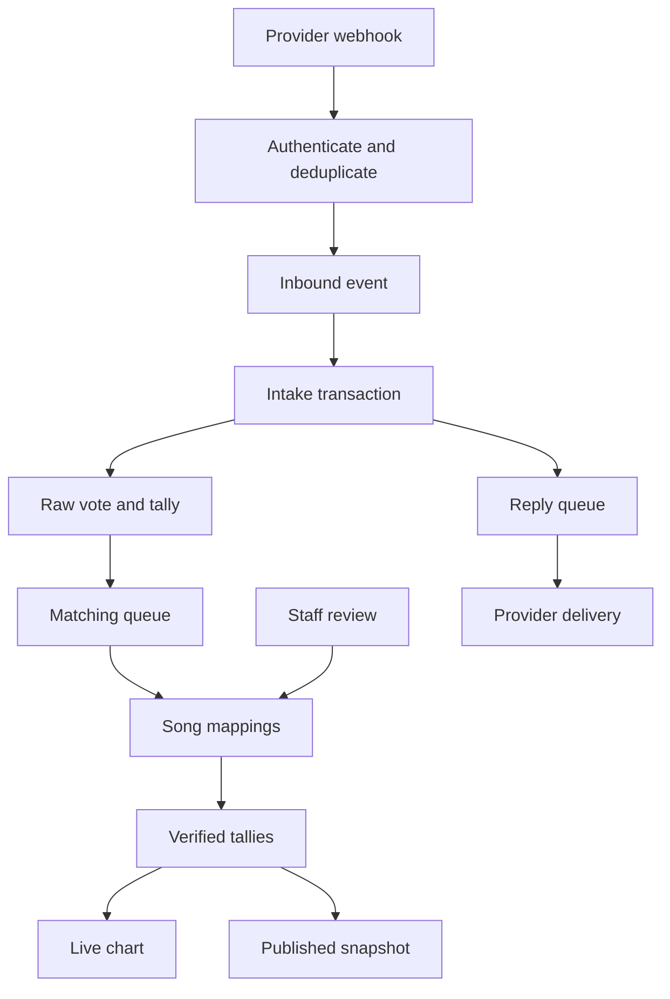

# Voting pipeline review — 26 September 2026

Base commit: `aa1ff99b06aca34d8a6344e46da8a3c84aeaf0da`.
Working branch: `codex/tauri-windows`.

## Architecture and data flow

This is a Django 5.2 application with a browser staff workspace and a Windows
WebView client. PostgreSQL is the production system of record; Redis supports
production caching/login throttling. The active voting queue is database-backed,
driven by `run_vote_worker`, rather than requiring Celery for each vote.

- `apps/bot/views.py`: provider authentication, payload validation, station
  binding and deduplication by provider/station/message ID.
- `apps/voting/services.py`: input cleaning, voter locking, daily quota,
  duplicate-song checks, raw vote/tally/job creation in one transaction.
- `apps/voting/worker.py`: leased work, retries, intake transactions and outgoing
  replies. Uncertain delivery is separated from safely retryable failures.
- `apps/voting/pipeline.py`: matching, reviewer decisions, merges and tally
  reconciliation under a station lock. External AI requests precede that lock.
- `apps/charts/publishing.py`: closed-week validation, backlog checks and
  historical chart snapshots.
- `apps/dashboard/` and `apps/accounts/`: staff APIs, permissions, station
  selection, authentication, exports and audit views.

Existing separation of intake, matching and delivery is appropriate. Replacing
it with another queue framework would add migration risk without demonstrated
benefit. These changes strengthen the current pipeline.

## Confirmed defects fixed

| Area | Reproduction / impact | Change |
| --- | --- | --- |
| Duplicate voting | A known alias and its still-unmapped canonical title could both be accepted before the matching worker ran. | Check exact verified catalogue identity, known aliases and the canonical key under the existing voter lock; preserve explicit reviewer mappings. |
| Outgoing delivery | A successful response containing `result: null` raised `AttributeError` and requeued a message that might already have been delivered. Missing or invalid IDs could also be recorded as success. | Validate response shapes and scalar IDs. Missing Telegram/Bird IDs and malformed responses become `uncertain` and are not automatically resent. |
| Webhook authentication | Non-ASCII secret headers caused `hmac.compare_digest` to raise outside the error handler. | Compare encoded bytes so invalid credentials receive 403. |
| Message identity | Structured or Boolean Telegram IDs could be stringified and persisted as legitimate delivery/listener identifiers. | Require scalar identifiers and positive integer private chat IDs, with non-negative integer update IDs. |
| Week/year boundary | On 1 January 2027 the current chart advertised calendar year 2027 with ISO week 53, although publication uses ISO year 2026. The archive default also selected the wrong year. | Use the ISO week year consistently for the live chart and archive default. |
| Historical peaks | Publishing an older week after a newer chart incorporated future rankings into the older peak position. | Limit historical peak queries to earlier weeks. |
| Review validation text | The edit error advertised 256 characters while accepting at most 240. | Make the message match the enforced limit. |

## Reconciliation efficiency

Previously, reconciliation loaded all matching aliases into a Python dictionary,
expanded them into SQL parameters, accumulated every date/song total in another
dictionary, then built all replacement model instances at once.

It now uses a database subquery for alias filtering and song resolution, SQL
grouping for totals, a streamed result iterator and inserts of at most 500 rows
per application batch. Affected-song filtering remains in the query, with the
existing station/match-key/date index available to the database. Date and station
boundaries, removal of rejected-song totals and the atomic replacement transaction
are preserved. A failed later batch rolls back the earlier inserts and deletion.

This reduces application-side materialization and SQL parameter growth. It is
not a measured production throughput claim: PostgreSQL query plans, lock wait
times and realistic data volumes still need measurement. Driver buffering and
database aggregation can consume additional memory beyond the 500 model objects.

## Validation

The original local suite passed: 99 passed, 1 PostgreSQL-only test skipped.
New regression tests reproduced the defects before application changes.

After the fixes:

- Full Python suite: **113 passed, 2 skipped**, with 4 delivery-response subtests
  passing. Both skips require PostgreSQL row locking.
- Final targeted reconciliation/regression rerun: **12 passed**, 4 subtests passed.
- Django system checks: passed.
- Migration drift check: passed; no schema changes are required.
- Ruff `F,E9`, JavaScript syntax, static collection and Git whitespace checks:
  passed.
- `pip-audit -r requirements.txt`: no known vulnerabilities found in the
  resolved pinned requirements at the time of the check.

Coverage includes both alias submission orders before matching, repeat-vote
policy, station isolation, malformed delivery, webhook IDs, year boundaries,
backfilled peaks, a 501-row rebuild and rollback after the second insert fails.
The receipt-time test also verifies that delayed processing retains the Harare
voting day. A new PostgreSQL test races 16 alias/canonical submissions for one
listener. PostgreSQL CI passed **115 tests and 4 subtests**, including both
concurrency tests; the browser workspace and desktop connection UI checks passed.

## Release limits and follow-up

These are source changes only; no production data, provider messages, published
charts or live deployment were changed. Changes are published for review in
[draft PR #2](https://github.com/dev-merit01/radio-zimbabwe-chatbot/pull/2).

1. Keep the PostgreSQL CI job green for the exact release commit. Both row-lock
   concurrency tests now pass in that job; SQLite alone cannot verify them.
2. Exercise Telegram, Bird and OneMsg with authorized test accounts, especially
   outgoing response envelopes and webhook signing. OneMsg's existing explicit
   success behavior without a message ID remains supported; account-specific
   delivery contracts still require verification.
3. Browser journeys passed in CI. The Tauri build and installer smoke test are
   additional gates; follow the clean-machine acceptance checks in
   `docs/WINDOWS_TAURI.md` before production distribution.
4. Known alias protection is prospective. Newly discovered fuzzy matches or
   later manual merges can reveal historical duplicates; this patch deliberately
   does not delete or retroactively disqualify raw votes. A retroactive policy
   requires an explicit station decision and an auditable migration.
5. Backfilled archives do not rewrite already published later snapshots. Publish
   weeks chronologically when movement and consecutive-week history must be
   complete at publication time.
6. Before further scaling, measure queue age, reconciliation duration, catalogue
   lookup plans and station-lock contention on PostgreSQL with representative
   traffic. The global per-station reconciliation lock remains a throughput
   boundary; avoid speculative partitioning before measuring it.

Server deployment instructions remain in `docs/WINDOWS_V2.md`; current Windows
client instructions are in `docs/WINDOWS_TAURI.md`. Update application
code and restart web and worker processes together after the release gates pass.
No new environment variables or migration commands are introduced by this patch.
